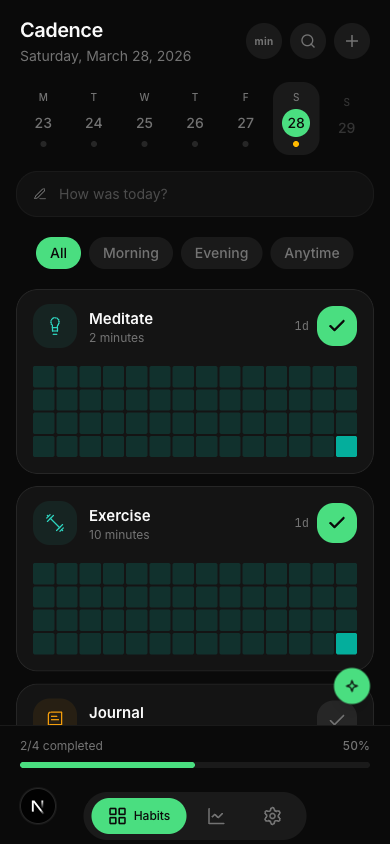
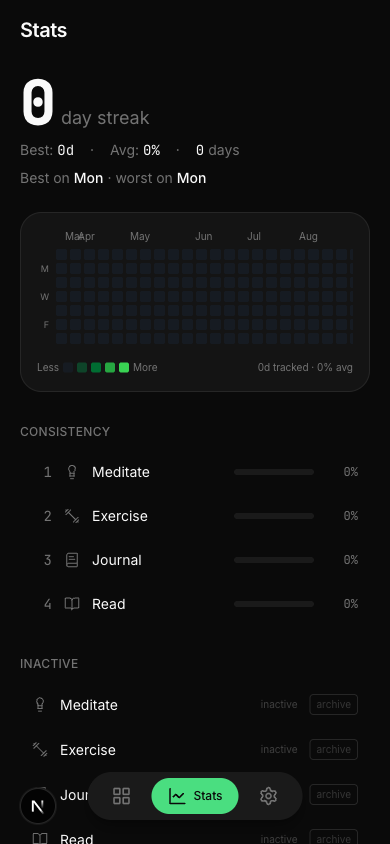
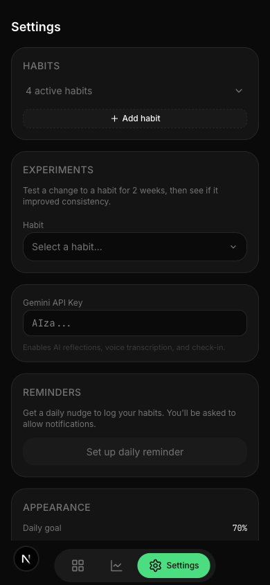
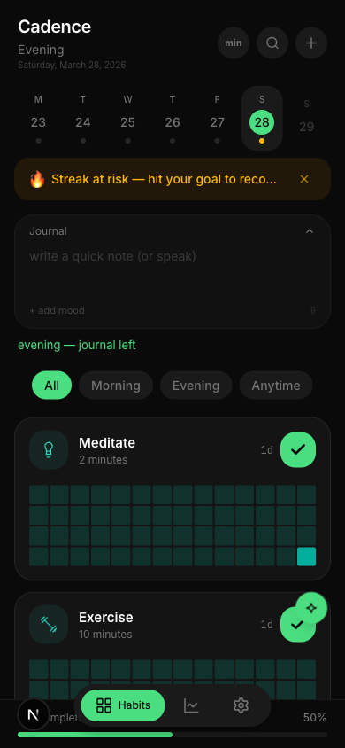
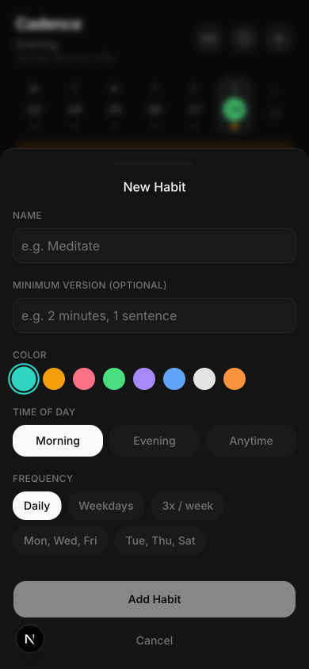
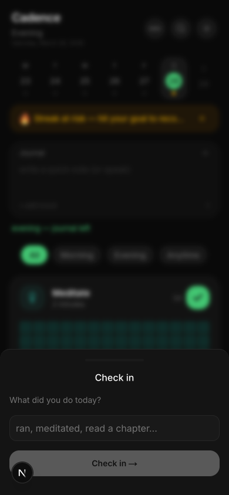

# Cadence

A personal habit tracking PWA that turns raw behavior data into actionable insights. Built with Next.js and GunDB

**No account. No cloud. Your data stays on your device.**

<p align="center">
  
  
  
  
</p>

## Features

### Habit Tracking
- Card-based habit list with per-habit mini heatmaps
- Swipe right to complete, swipe left for edit/skip/archive
- Inline friction scoring (easy/moderate/hard) after each completion
- Per-habit colors, weekly day selector, category filters
- Minimum mode for low-energy days (floor versions only)
- Habit bundles for one-tap batch completion

<p align="center">
  
  
</p>

### AI Check-in
Describe your day in text or voice. AI classifies which habits you completed, asks about uncertain ones, and lets you apply with one tap.

<p align="center">
  
</p>

### Voice Journal
Tap the mic, speak, and your thoughts are transcribed via Gemini. Journal entries are linked to each day and feed into weekly reflections.

### Intelligence Layer
- **System Health Score** — single 0-100 number showing if your system is stable, declining, or recovering
- **Keystone Habit Detection** — surfaces habits that boost everything else when done
- **Habit Decay Alerts** — flags habits dropping in consistency before you notice
- **Root Cause Detection** — connects journal entries + friction to explain *why* you miss habits
- **Focus Habit** — auto-highlights the habit most at risk of being skipped
- **Time-to-Complete** — shows when you typically do each habit
- **Streak Recovery** — 1-day grace period to recover a broken streak

### Stats
- GitHub-style contribution heatmap (365 days)
- Per-habit consistency ranking with progress bars
- Best/worst day of week analysis

### Weekly Reflection
AI-powered conversational review of your week. Surfaces what worked, what didn't, and suggests adjustments. Reflection patterns are saved and referenced in future weeks.

### Experiments
Test a change to a habit (move to evening, change frequency) for 2 weeks, then see before/after comparison. Keep or revert with one tap.

### Skip Intentionally
Mark a habit as intentionally skipped with a reason. Removes guilt, improves data quality, and helps the AI understand your patterns.

### Settings
- Per-habit color picker (8 colors)
- Accent color theming (7 options including white)
- Daily goal slider
- Push notification reminders
- Data export (JSON + Markdown)
- Encrypted API key storage (AES-256-GCM)

## Tech Stack

| Layer | Tech |
|-------|------|
| Framework | Next.js 16 (App Router) |
| Database | GunDB (local-only, IndexedDB) |
| AI | Gemini 2.5 Flash |
| Styling | Tailwind CSS v4 + shadcn/ui |
| Animations | Framer Motion |
| Gestures | @use-gesture/react |
| Encryption | Web Crypto API (AES-256-GCM) |
| Push | Web Push API + Vercel Cron |
| Deploy | Vercel |

## Getting Started

```bash
cd cadence-frontend
npm install
npm run dev
```

Open [http://localhost:3000](http://localhost:3000).

### Environment Variables (optional)

Push notifications require VAPID keys. Generate with:

```bash
npx web-push generate-vapid-keys
```

Then set in `.env.local`:

```
VAPID_PUBLIC_KEY=...
VAPID_PRIVATE_KEY=...
VAPID_MAILTO=mailto:you@example.com
```

## Architecture

```
cadence-frontend/
  src/
    app/
      api/           # Serverless API routes (transcribe, checkin, reminders, gemini)
      page.tsx        # Entry point — onboarding gate → app shell
    components/
      habits/         # Habit cards, journal, check-in, drawers
      stats/          # Stats page, heatmap, health ring
      system/         # Settings, experiments, bundles, reminders
      layout/         # App shell, bottom tabs, header, accent provider
    lib/
      gun/            # GunDB client, provider, data cache, types
      hooks/          # All custom hooks (habits, logs, stats, journal, etc.)
      crypto/         # API key encryption (AES-256-GCM key vault)
      utils/          # Dates, frequency, tags, habit icons
```

Data flows through a centralized `DataProvider` that loads all habits and logs once from GunDB, then all hooks derive from the shared cache. Tab switching is instant (CSS-hidden, not unmounted).

## License

MIT
